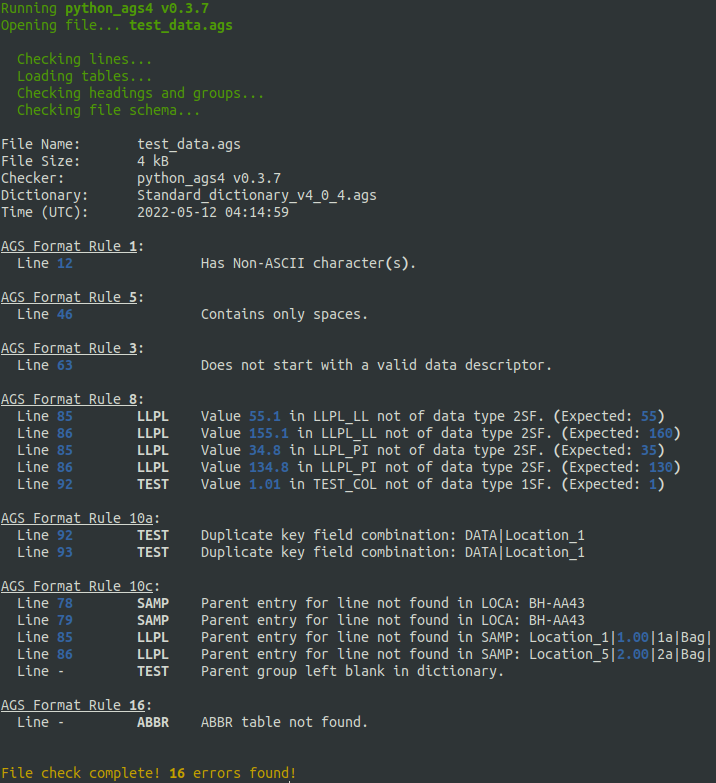

# Summary

Data gathered from geotechnical, geoenvironmental, and geophysical
investigations can be broadly described as "geodata". The AGS4 data format
[@AGS:2011; @AGS:2017; @AGS:2021; @AGS:2022] is one of the most widely used data
transmittal formats for geodata and is used across the world. It is a plain text
format consisting of multiple tables of comma-separated values, tied together
with a robust data schema and a comprehensive suite of validation rules. The
basic structure of an AGS4 file is shown in Figure 1.

Source: @AGS:2022

`python-ags4` is a Python library that provides functionality to read, write,
and validate AGS4 geodata files. It provides users with a gateway to access the
full power of the Python ecosystem to explore, analyze, and visualize geodata.
Pandas DataFrame [@reback2020pandas] is the primary data structure used within
the library, therefore it can handle relatively large datasets reasonably fast.
The data validation module checks the file for compliance with the validation
rules and provides a detailed error report. An example error report is shown in
Figure 2.

{ width=75% }

# Statement of Need

This library fulfills the following needs of the engineering and scientific
community that uses AGS4 geodata files:

- Provide a transparent and easily accessible tool to validate AGS4 geodata
  files.
- Provide access to the Python ecosystem to users of AGS4 geodata.
- Provide a cross-platform tool to work with AGS4 geodata files.

Having a free and open-source tool that can validate AGS4 files will help
producers and receivers of data check that the geodata file is of the required
standard. It also lowers the barrier to entry for those who are not familiar
with this data format and fosters data sharing and collaboration. `python-ags4`
has already been adopted by the British Geological Survey to work with its large
repository of publicly available AGS4 geodata files.

Python has a rich ecosystem of packages that can be utilized to analyze and
visualize data. The ability to easily import geodata from AGS4 files will
greatly enhance the ability of engineers and scientists to interpret data and
improve knowledge of ground conditions. A Jupyter Notebook with examples of how
to import data to Pandas and GeoPandas [@jordahl:2020] for statistical and
spatial analyses and visualize using Matplotlib [@Hunter:2007] is provided in
the git repo of this library. We provide an example for users in the git repo.

The command-line interface included with the library is a convenient and easy to
use tool to work with AGS4 geodata files. It is cross-platform and has been
tested in Linux, Windows, and Mac environments.

The current state of practice for validation of AGS4 files is to use one of two
proprietary software, namely [KeyAGS
Checker](https://communities.bentley.com/products/geotechnical1/w/wiki/50417/keyags-free-version),
which is freeware, and [gINT AGS
Checker](https://www.bentley.com/en/products/brands/gint), which is part of the
widely used `gINT` geotechnical data management suite. They are only available
for the Windows operating system and can provide slightly different results in
some cases. Therefore, validators based on `python-ags4` are expected to become
the standard in the future and provide a single source of truth for the validity
of AGS4 files [@AGS_website_2021; @chandler_2021].

The open-source geotechnical software package
[groundhog](https://groundhog.readthedocs.io/en/master/index.html) also provides
functionality to import AGS4 data to Pandas DataFrames, therefore it can be used
as an alternative to `python-ags4` in this regard. However, the main focus of
that package is general purpose geotechnical engineering calculations so it does
not provide functionality to validate and export AGS4 files.

# Ongoing Projects

`python-ags4` has been implemented in two free and open-source software
projects, making the library more accessible to non technical users.

- [Windows
  application](https://gitlab.com/ags-data-format-wg/ags-checker-desktop-app)
  offering the functionality of the library
- [API](https://github.com/BritishGeologicalSurvey/pyagsapi) and
  [GUI](https://agsapi.bgs.ac.uk/) developed by the British Geological Survey,
  offering the functionality of the library on the web.

It has also been used in commercial projects. (e.g.
[https://digitalgeotechnical.com/apps-home/](https://digitalgeotechnical.com/apps-home/))

# Acknowledgements

The authors acknowledge the work done by the AGS Data Format Working Group to
develop the AGS4 data format and the support it has extended to develop this
library.

# References
